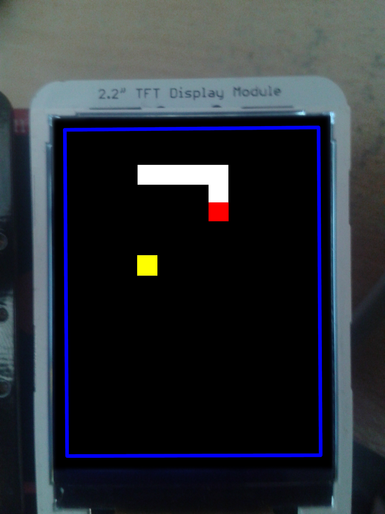
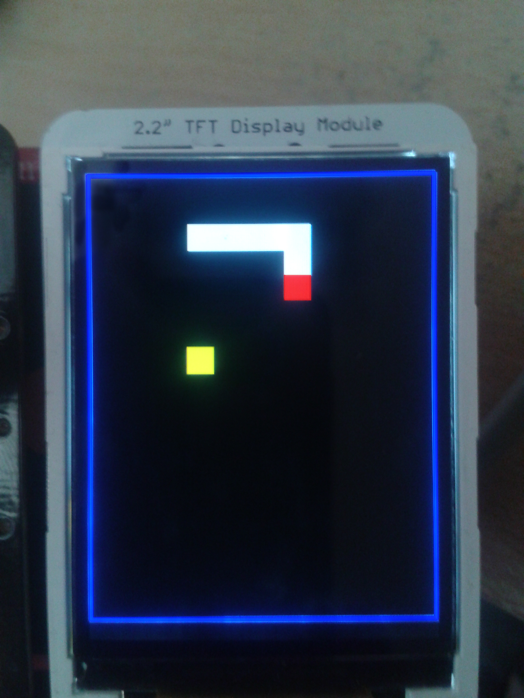

AVR-snake
===============

Compiling and installing 
------------------------

After downloading the source code you can use the included make file to compile and install the program onto your micro-controller.

To compile the tool use the command

```bash
make
```

Or you can install and flash the program to your chip using avrdude with the command. This may require root access

```bash
make install
```

Compiling and installing has been tested on *Ubuntu 14.04* with the *atmega644p* chip. Other platforms or chips may require some changes to the make file or source code.

Example images
-------------------





Original setup
-------------------

This code was designed for the following hardware:

> Chip: atmega644p
>
> Screen: 240x320 18-bit color screen
>
> Screen driver chip: a-Si TFT LCD Single Chip Driver ILI9341


